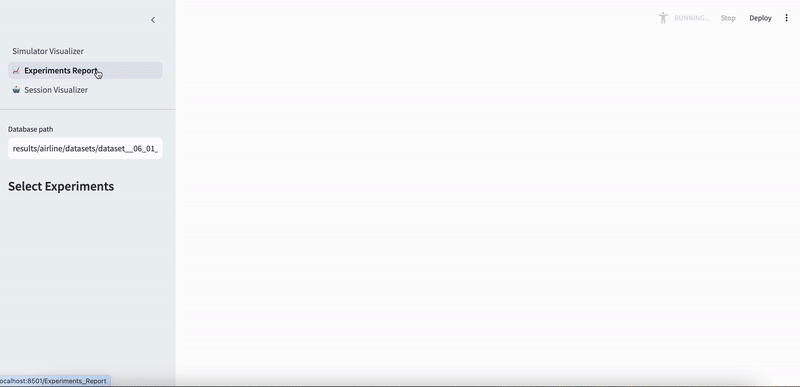

<h1 align="center">
  
</h1>
<p align="center">
  <i>Know your chatbot</i>
</p>

<p align="center">
    <!-- community badges -->
    <a href="https://discord.gg/G2rSbAf8uP"></a>
    <!-- license badge -->
    <a href="https://github.com/plurai-ai/Chat-Agent-Simulator/blob/main/LICENSE">
        </a>
</p>

<h4 align="center">
    <p>
        <a href="">Documentation</a> |
        <a href="#fire-quickstart">Quick start</a> |
        <a href="">NewsLetter</a> |
        <a href="">Paper</a>
 </p>
</h4>


<!-- MARKDOWN LINKS & IMAGES -->
<!-- https://www.markdownguide.org/basic-syntax/#reference-style-links -->


**Chat-Agent-Simulator (CHAS)** is an AI-powered diagnostic framework driven by Large Language Models (LLMs) and AI agents. It simulates thousands of edge-case scenarios to comprehensively evaluate chatbot agents. By stress-testing your agent from all angles in wide-range of complexity levels, CHAS helps identify potential failure points and provides detailed performance analysis to ensure reliable deployment.

Don't limit your chatbot's potential because of what you don't know. Use CHAS to know exactly what your agent can handle, fix what it can't, and deploy with confidence.

## Key Features


- 🔬 Simulates thousands of **realistic** edge-case events tailored to your chatbot agent and system data schema
- 🤖 Simulates user interactions with your agent based on generated events
- 📊 Comprehensive report with evaluation metrics including success rates, policy & tools failure points, complexity-level analysis
- 💪 Enables confident deployment of more reliable chatbot agents

## 🔍 Demo



## :fire: Quickstart

> For a more detailed and comprehensive guide, see the [Quickstart Guide](TODO add reference).


Chat-Agent-Simulator (CHAS) requires `python == 3.10`
<br />

#### Step 1 - Download and install

```bash
git clone git@github.com:plurai-ai/Chat-Agent-Simulator.git
cd Chat-Agent-Simulator
```

You can use Conda, pip, or pipenv to install the dependencies.

Using pip: 
```bash
pip install -r requirements.txt
```


#### Step 2 - Set your LLM API Key

Edit the `config/llm_env.yml` file to set up your LLM configuration:

```yaml
openai:
  OPENAI_API_KEY: "your-api-key-here"
```

####  Step 3 - Run the Simulator

```bash
python run.py --output_path results/airline --config_path ./config/config_airline.yml 
```

Explore all the [Customization](TODO add reference) options to configure the simulation for your environment.

#### Step 4 - See the Results

To visualize the simulation results using streamlit, run:
```bash 
streamlit run simulator/visualization/Simulator_Visualizer.py
```
This will launch a[ Streamlit dashboard](./README.md#-demo) showing detailed analytics and visualizations of your simulation results.

## Roadmap

- [x] **Beta Release**
- [ ] Expand Integration with More Agent Platforms
    - [ ] CrewAI
    - [ ] AutoGen
- [ ] Enable Event Generation from Existing Databases
- [ ] Implement API Integration for External Chatbot Agents
- [ ] Add Personality Dimensions to User Agents
- [ ] Optimize Chatbot Performance Using Simulator Diagnostics (Access now by joining our [premium program](TODO))
    - [ ] System Prompt Optimization
    - [ ] Tools Optimization
    - [ ] Graph structure Optimization

**Join our [Discord community](TODO) to shape our roadmap!**


## 🚀 Community & Contributing

Your contributions are greatly appreciated! If you're eager to contribute, kindly refer to our [Contributing Guidelines](docs/contributing.md)) for detailed information. We’re particularly keen on receiving new examples and environments to enrich the project.

If you wish to be a part of our journey, we invite you to connect with us through our [Discord Community](TODO). We're excited to have you onboard! 

## Citation

TODO


## 🔍 Open Analytics

We collect basic usage metrics to better understand our users' needs and improve our services. As a transparent startup, we are committed to open-sourcing all the data we collect. **Plurai does not track any information that can identify you or your company.** You can review the specific metrics we track in the [code](https://github.com/plurai-ai/simulator/healthcare_analytics.py).

If you prefer not to have your usage tracked, you can disable this feature by setting the `PLURAI_DO_NOT_TRACK` flag to true.

## ✉️ Support / Contact us
- Join our Community for discussions, updates and announcements [Community Discord](TODO)
- Our email: [‫chas@plurai.ai‬](mailto:chas@plurai.ai)
- [GitHub Issues](https://github.com/plurai-ai/Chat-Agent-Simulator/issues) for bug reports and feature requests


